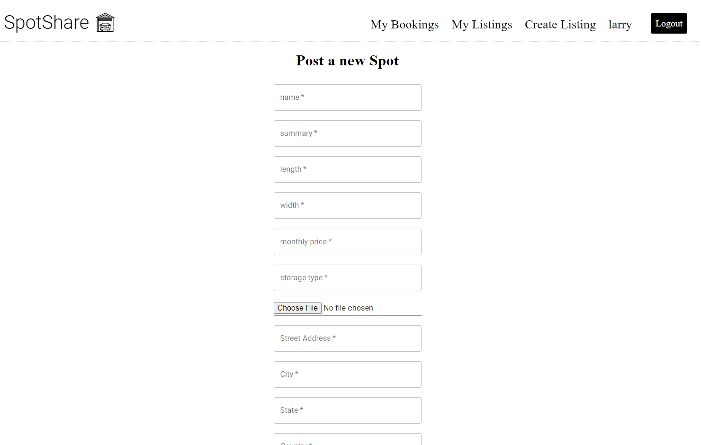
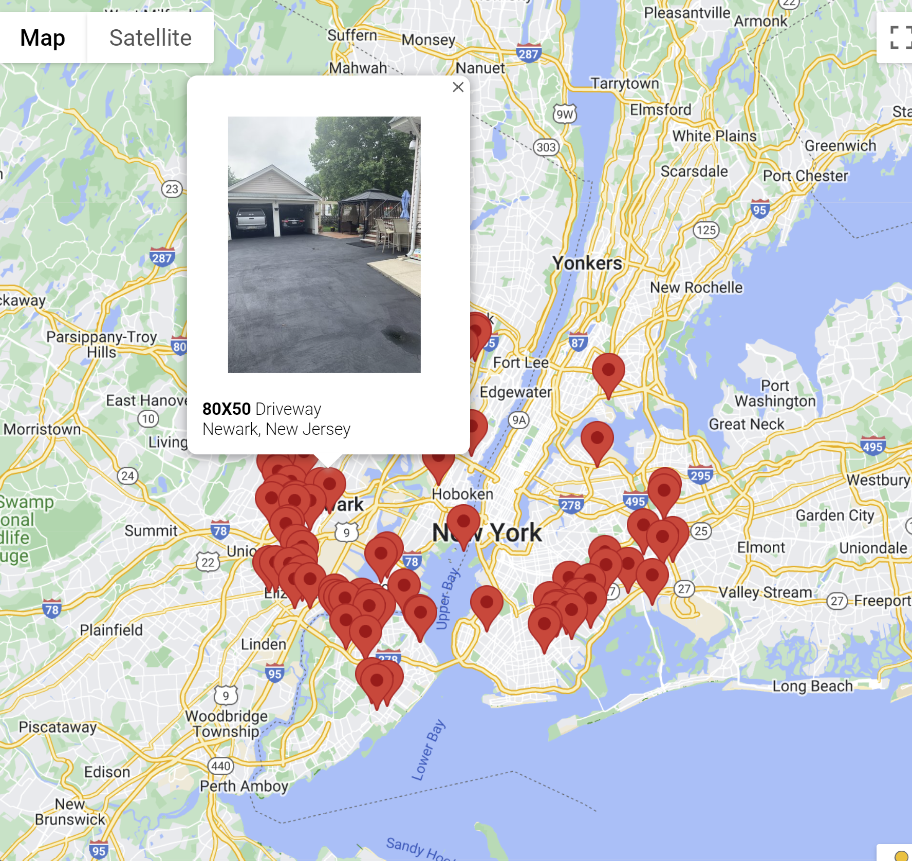
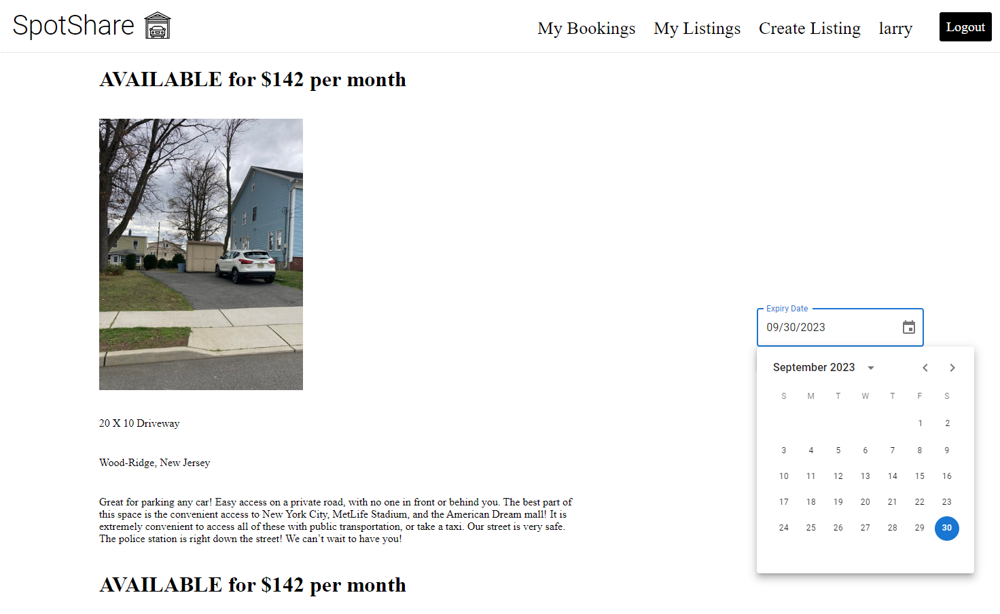
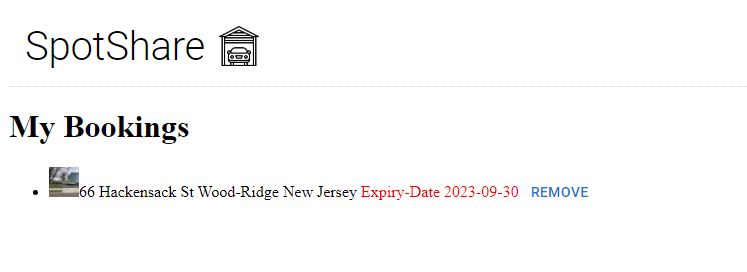
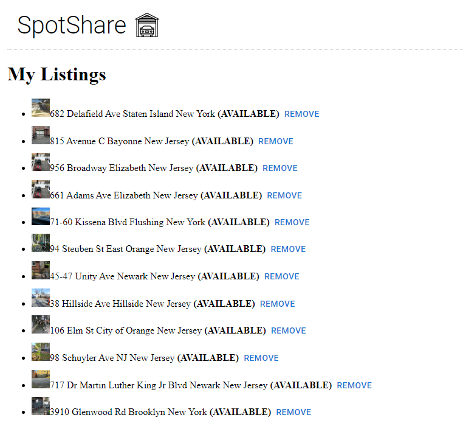

# SpotShare is a fullstack web application that solves the cities lack of parking spots.

SpotShare is a REACT web application born from the concern over insufficient parking availability in New York. For individuals who lack a personal residence but must journey to their workplaces, the assurance of a designated parking spot proves immensely advantageous. This innovative concept serves as a remedy to the scarcity of parking spaces by harnessing existing supply. Property owners now have the option to lease out their driveways and garage spaces for a mutually agreed-upon fee, thus presenting a practical resolution.

|                  *Homepage*       |
|:-----------------------:|
|  |

Employing REACT, I organized the frontend, establishing CRUD operations to interface with backend API endpoints. This setup empowers users to generate and manage their individual listings for display on the platform. Leveraging the Google Geocoding API, the provided address undergoes conversion into precise latitude and longitude coordinates. These coordinates are subsequently processed using the Google Maps JavaScript API, enabling their seamless visualization. The central webpage showcases an array of available rentals presently on offer, seamlessly accessible via a dedicated GET route.

|           *new post*              |                  *open rentals*       |
|:-----------------------:|:-----------------------:|
|  |  |

Every map pin is associated with an information window that directly links to the corresponding individual listing page. Within this dedicated page, users gain access to the Material UI date picker, facilitating convenient booking of parking spaces.

|                  *info windows*       |           *individual listing*              |
|:-----------------------:|:-----------------------:|
|  |  |

User bookings are intelligently sorted using booking IDs, which are in turn matched with specific listings. The listings themselves are organized according to the user's unique ID. This design yields a straightforward and easily traceable user interface, enhancing the customer's ability to monitor their interactions seamlessly.

|                  *bookings*       |           *listings*              |
|:-----------------------:|:-----------------------:|
|  |  |
